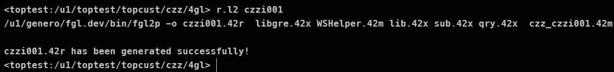

# 程序开发生命周期

在windows 下，利用`记事本`这个软件，输入并编辑文件可以保存一个`.txt`后缀名的文件。类似的还有`.xlsx`。它们都可以通过记事本或者excle这类的软件打开，但本身是无法运行或者展现内容的。

那么你有没有想过如何产生一个`.exe`可执行文件呢。

聪明的你一定知道了。
是的，通过编写某种语言的源代码，编译成功通过后，在经过链接，成功后就可以产生一个可执行的文件。这就是所谓的程序。

## 编写`BDL`源代码


**关于环境的说明**  
如果你是使用鼎捷系列软件，那么你需要新建一个程序代码，如何建立本书不会介绍。

如果你要学习，可以见`TIPTOP`相关书籍，本书只介绍代码部分。

由于`t100`与`tiptop` gp编译和链接代码也不同，所以本书以`tiptop gp`命令为主，如果你使用不同的系统，请自行替换为你系统的代码。

例如：`tiptop gp` 使用`r.l2` 连接，`t100`使用`r.l` 连接。

为什么不以底层`fgllink`写呢，因为`license`原因，有的环境可能不允许使用这类命令，所以不再赘述。



## 编辑BDL源代码

编辑BDL源代码就是做如下工作：
1. 逐个输入字符，如汉字、英文、标点符号或者其它可以用键盘输入的字符
2. 通过插入、删除、移动、复制、粘贴等方法修改已经输入的字符
3. 将输入修改完毕的所有字符保存到硬盘上

一篇由汉字、英文、标点符号或者其它可以用键盘输入的字符的内容被称作文本。
能够进行文字编辑的软件被称作编辑器。

通俗的将，源代码就是程序员输入编写的符和BDL语言语法规则的文本。
如下片段就是一段源代码:

```sql
main
    display smft("Hello World!")
end main
```

扩展名用`.4gl`标识其为一个BDL源代码文件。源代码文件简称源文件。

编辑器的功能很大程度上能够帮助程序员提高工作效率。只要能输入文字的文本编辑软件都可以作为源代码编辑器。
如记事本软件、字处理软件Word、vs code等。但是专业程序员一般采用专业源代码编辑器，如业界鼎鼎有名的编辑工具由VI/VIM、Emacs/XEmacs等。
一个好的源代码编辑器、要求具备关键字着色功能（可以使用不同颜色标识代码的不同部分）、优秀的代码跳转功能、代码自动补全功能等。


## 编译BDL源代码

编译时BDL源代码翻译成用二进制指令标识的目标文件。
这里的目标文件与机器语言还有一段距离，并不是真正的机器语言，所以不能被计算机直接运行。

编译过程由编译系统程序完成。编译程序简称为编译器。编译程序运行后，自动对源程序进行句法和语法检查，当发现错误是，就将错误的类型和所在位置显示出来，帮助修改程序中的错误。
用户可以继续利用编辑器对源程序进行修改。修改后，重新编译，直到编译通过为止。

## 连接目标文件

多个源代码文件经过编译后产生了多个目标文件，此时还没有将其组合装备为一个可以运行的整体，因此计算机还是不能执行。

连接过程是用连接程序将目标文件、第三方目标文件、BDL语言提供的运行时的一些函数装配为一个完成的可执行的目标程序。

## 编译连接过程示例

有时候为了叙述方便，将编译和连接两个步骤，统一用编译一个词语代替，读者应该清楚实际经历了两步。

1. 当源代码没有报错是，编译连接过程如下：


2. 当编译时，不会产生目标文件，如下：


> 现在你可能还看不懂提示信息的含义，不用担心，后面章节会慢慢了解到。现在你只要关注如果源代码错误，会出现什么情况即可。

3. 有时候编译通过了，但连接不一定通过。如下：


## 运行程序

BDL程序部署在服务器，在服务器端运行，需要本地电脑开启GDC客户端，并确定端口正确。

运行的命令为`exe2 czzi001`,czzi001为程序编号。