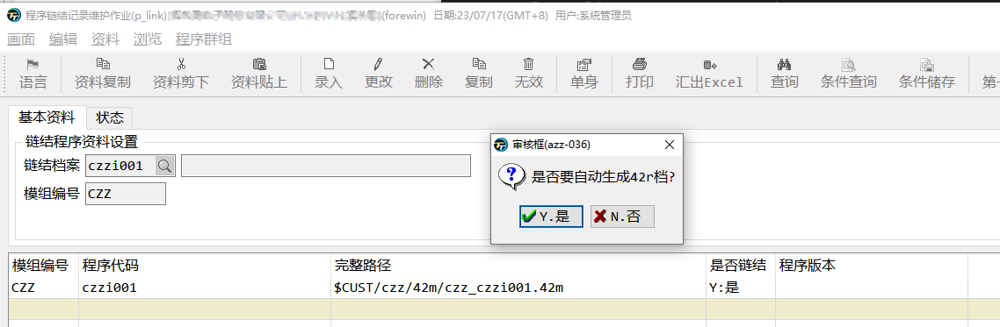

# BDL开发环境

本书所有代码运行的环境都在`fjs-fgl-2.4`版本，开发环境为linux系统。
本书不涉及环境如何部署。

## 项目目录结构

`tiptop gp` 和 `t100` 都有固定的项目结构，[点此查看](https://darcyjoven.com/directory-structure-of-tiptop/)。
建议你在不影响正式使用的程序前提下，建立或修改程序代码。




## 编译

`tiptop gp`环境中需在代码对应的`4gl`目录下，运行命令`r.c2 czzi001`，czzi001是你建立的程序编号。即4gl文件去掉后缀名后的内容。

## 连接

`tiptop gp`连接命令为 `r.l2 czzi001`，注意：这里的`czzi001`不是`4gl`文件程序编号，而是在`p_zz`中注册的程序。所以在运行`r.l2`连接之前，你还需要做以下这些步骤。


1. 新增`p_zz`资料
如果你现在还不知道`p_zz`作业的功能，没关系，现在你可以参考czzi001的内容，将czzi001替换为你的程序编号，czz替换为你的程序编号前三位。


> 需要注意的时czzi001.4gl 一般放在czz/4gl目录下，同样azzi001.4gl 也放在azz/4gl目录下，在你更进一步理解BDL的目录结构前，就一直按照这种方式建立新程序。

2. 点击维护链接资料建立连接资料 (链接和连接是同一种说法的不同翻译)




新建程序时，会提示你无资料，是否建立，这里选择是。
看到下方有一笔路径为`$CUST/czz/42m/czz_czzi001.42m`的资料。
当后续我们程序更复杂时，会主动添加更多需要的连接资料。

最后保存时此弹窗的意思，是让你自动连接一次，可以选择是，连接失败也不要仅，只要资料有产生就可以。



## 编译




## 开始编辑代码

以上设置好之后，你就可以编辑代码了。


我用的vs code编辑器，配合`Informix 4GL`这款插件，所以代码可以高亮，不同的单次有不同的颜色，起到了提醒的作用。

除了`vscode`，`t100`自带的开发平台`T100 design`、`submlime text`、4js官方提供的`genero studio`等工具也能有高亮样式。

```sql
database ds  -- 指定数据库，因为t100和tiptop gp有部分功能必须使用数据，所以这里必须先连接数据库
MAIN --主函数 入口点
    DISPLAY "Hello World" -- 打印字符串
END MAIN
```
> 也许你注意到了，`database`是小写，`MAIN`是大写，在BDL语言中，大小写是不区分了，类似于SQL。你甚至了混合使用。

