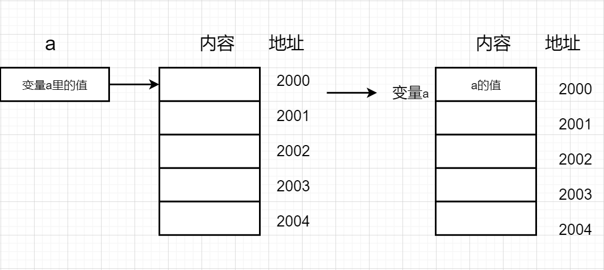

# 变量--数据从哪里来，又到那里去

在计算机程序设计中，经常要用到变量。比如在屏幕中移动光标，需要存储光标的x，y坐标，每次移动光标，就需要对坐标修改，也就是x、y的值要改变;为了得到当前光标的坐标，就需要从x、y中得到当前的值。在程序设计中这些值都是通过变量来完成的。

## 变量在内存中的表现形式


变量是指其值可以变化的量。在计算机中，指令代码、数据都存储于内存中。变量也需要存储在内存中。


类比人类的思维过程，也很容易明白为什么需要内存空间存储变量:假设现在有3个数据，分别是a=3,b=4,c=5，需要读者去计算“a+b+c"的值。
读者首先回忆a的值是3，b的值是4,c的值是5，然后分别用3、4、5作为计算的数得到“3+4+5=12”。

这是一个很简单的过程，思考过程几乎不花费时间。如果计算的变量超过100个，估计大部分读者都记不住这么多数据的值，需要把这些数据及其对应的数值记录在纸上或其他地方，当需要用到某个数据的时候，再去查看其对应的值。计算机中变量的作用与它类似。

在计算机中，每个变量都被分配了一块内存空间，在这些空间里存储的就是变量的值。
变量之所以可以变化，就是这个存储空间可以存储不同的数值。存储空间里的值变化，则变量对应的值也变化。
同一个时间，内存空间里只能保存一份值，**新值冲掉了原来的旧值**。
每个内存单元都有编号，这些是内存的地址。如图所示。



## 编译器使用变量符号表

在源代码中，每个变量都有变量名。
实际上，编译后的目标代码里并没有变量名字，而是记录着变量在内存空间中的地址。
在BDL语言中，通过变量名就可以访问到变量的值，对变量名的访问，就是对变量值的访问。

在编译的过程中，编译器会建立-张变量符号表，该表记录的数据是:变量类型、变量名、变量地址等信息。

## 变量及其使用

变量有不同的类型，如记录英文字母及标点符号，就需要字符类型(varchar)的变量；
记录整数需要整数类型integer的变量；
记录实数有decimal类型的变量。
这些变量都是数值类型，BDL语言还提供了其他类型的变量，详细讲解请参见后续章节的论述。

通过上述的简单叙述，读者可以对变量有了一个大概的感性认识。再回过头来看看源代码中每行的意思。

```sql
databse ds
main
    define a,b integer  --定义a,b 为整型
    define y integer    --定义y为整型

    let a = 1           --将变量a赋值为1，此时a的值为1
    let b = 1           --将变量b赋值为1，此时b的值为1
    let y = a + b           --将a，b的值分别取出来，计算结果后，赋值给变量y
    display sfmt("\na+b=%1",y) --将y的值打印出来
end main
```

1. `define a,b integer`

这是向编译器声明，以下程序将会用到两个整型变量，其名字为a和b。此时并不会进行真正的内存分配动作，也就是此时并没有内存地址与变量名关联。

“define”是BDL语言提供的关键字，需要定义变量时必须使用。

“integer”是BDL语言提供的关键字，是integer (整数)的缩写，表示为整数数据类型，简称整
型。

其后紧跟的是变量名称，变量名由程序员命名。变量名称也必须是字母开头，其后的部分可以是字母、数字、下划线的组合。
在同一行中可以声明多个变量，变量间用逗号分隔。

2. `define y integer`

同样是向编译器声明，以下程序会用到整型变量y。变量可以一行声明多个，也可以一行声明一个，多个变量分多次声明，意义都一样。

3. `let a = 1`

这是给a赋值。
“let”是是BDL语言提供的关键字，需要给变量赋值是必须使用（后面也有其它办法赋值）。
请读者注意等号“=”，“=”是BDL语言提供的运算符。
在BDL语言里的“=”不同于数学里的等号“=”。
数学中的等号是说“=” 两边相等，左右等价，可以交换。
计算机中的“=”是赋值符号，有一个运算顺序，是先计算“=” 右边的表达式的值，然后把数值赋给左边。左右不能交换。
所谓赋值，就是把运算所得的数值存储在内存中。

当第一次访问变量的时候，编译器将给变量分配内存。所谓访问，就是“存取”，“存”，是把数据存储在内存中，“取”，是从内存中把数据取出来。



**注意**  
从内存中取数据的“取”和从篮子里把南瓜“取”出来有些区别。
南瓜从篮子里取走后，篮子里不再有任何东西，南瓜被拿走了。
而计算机内存中的取，是把数值复制出来，内存空间里面的数值并不会变化，也就是从内存空间里把数值“读”出来。


4. `let b = 1`

同样的，编译分配内容空间给变量b，然后将数值1放到对应的空间中。

5. `let y = a + b`

这里的“+”，也是BDL语言提供的运算符号。同数学里的四则运算中的“+”一样，进行加法运算。

注意本行代码运算顺序：
+ 先获取a的值。a是变量名称，查询变量符号表，得到地址，再从地址中取到数值1。则a的值为1--`let y = 1 + b `
+ 再获取b的值。同样的过程，b的值也为1--`let y = 1 + 1`
+ 计算 1 + 1，得到数值2--`let y = 2`
+ 把数值2赋给y`let y = 2`
6. `display sfmt("\na+b=%1",y)`
把y的值打印出来。
这里同样要访问变量y去获取其值。

