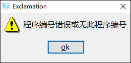

# 重新回顾编译链接

在[第二章](../../../1.basic/2.first_code/2.environment_of_BDL)时，我们就介绍了`r.c2`与`r.l2`编译链接的命令。
还介绍了`exe2`运行的命令。

现在我们新建一个`czzi004.4gl`程序：

```sql
main
    display "program code is czzi004"
end main
```

我们上传在`$TOP/czz/4gl`目录中，运行`r.c2`命令：

如果环境没有问题，将输出类似下面结果:

```bash
czzi004  ..............
```

编译成功，因为我们没有调用外部函数，所以不用链接也可以运行。

我们使用`exe2`命令运行，如没有意外，会出现以下意外：



这是因为我们在`tiptop gp`中，未通过`p_zz`作业建立程序，所以系统找不到执行文件目录。

我们运行以下命令

```bash
cd $CZZ/42m
fglrun czz_czzi004
...
program code is czzi004
```

成功运行！这是因为我们的可执行文件是在`czz/42m`目录下，我们来看下42m生成的文件。

```bash
cd $CZZ/42m
ls -l *czzi004*
```

```bash
-rw-rw-rw- 1 tiptop tiptop 242 Aug 28 14:46 czz_czzi004.42m
-rw-rw-r-- 1 tiptop tiptop  52 Aug 28 14:46 czz_czzi004.4gl
```

`czz_czzi004.42m`是4gl编译后的二进制文件，`czz_czzi004.4gl`是我们在使用`r.d2+`debug调式时需要的文件。

而`fglrun`命令是真正的BDL执行文件，`exe2`命令其实是`tiptop gp`专用的运行命令，所以`p_zz`中没有录入的程序无法用exe2运行。

既然运行有底层命令，那么编译、链接自然也有对应的底层命令。


## fglcomp

还是之前的`czzi004.4gl`文件，我们切换到4gl目录下，使用底层函数编译。

```bash
cd $CZZ/4gl
fglcomp czzi004.4gl
```

**注意**

使用`fglcomp`编译时需要指定文件的全名，包括扩展名。



**错误**

如果出现这个报错，说明你的授权不包含编译授权，请运行命令`FGLDIR=$FGLDIR.dev`切换到测试环境编译。
```bash
ERROR(-6112):Compilation is not allowed: This product is licensed for runtime only.
```



如果编译成功，不会有任何提示，我们运行`ls -l *czzi04*`查看当前目录下`czzi004`相关文件。

```bash
-rw-rw-r-- 1 tiptop tiptop 211 Aug 28 14:59 czzi004.42m
-rw-rw-r-- 1 tiptop tiptop  52 Aug 28 14:46 czzi004.4gl
```

可以看到，`fglcomp`编译后在当前目录产生了`czzi004.42m`文件，且并不产生额外的`4gl`文件。

我们用`fglrun`命令运行以下。

```bash
cd $CZZ/4gl
fglrun czzi004
...
program code is czzi004
```

可以看到和`r.c2`编译后文件输出内容一样。


## fgllink

之前我们编写的程序，都是单一文件，所以并不需要链接操作。

1. 现在我们再来写一个文件`czz/4gl/s_czzi004.4gl`

```sql
function add(a,b)
  define a,b integer
  return a+b
end function
```
内容很简单一个可以返回两个整数之和的`add()`函数，我们先来编译`fglcomp s_czzi004.4gl`。

如果没有写错，将在当前目录产生`s_czzi004.42m`文件。

2. `czzi004.4gl` 调用`add()`

```sql
main
    display "program code is czzi004"
  + display sfmt("2+3=%1",add(2,3))
end main
```

3. 重新编译`czzi004.4gl`


这个时候，`czz/4gl`目录下应该包含两个`42m`文件，`czzi004.42m`和`s_czzi004.42m`。

如果你尝试运行任意一个文件，都会报错。

`fglrun czzi003`

```bash
program code is czzi004
Program stopped at 'czzi004.4gl', line number 3.
FORMS statement error number -1338.
The function 'add' has not been defined in any module in the program.
```

`fglrun s_czzi004`

```bash
FORMS statement error number -1338.
The function 'main' has not been defined in any module in the program.
```

当调用外部函数时，我们需要使用`fgllink`链接命令将多个42m文件链接起来。

`fgllink -o czzi004.42r czzi004.42m s_czzi004.42m`

这时，查看当前目录，你能看到产生了一个`czzi004.42r`文件。运行42r文件能够正常得到运行结果。

```bash
fglrun czzi004
program code is czzi004
2+3=5
```

## 总结

BDL中每一个可执行文件，只要经过3个步骤即可。

1. fglcomp 编译

将主程序，和主程序要用到的程序源代码全部编译为42m文件

2. fgllink 链接

将主程序和所有需要用到的程序42m文件链接为42r文件

3. fglrun 运行

执行42r文件即可


## 练习

### 在`czzi004.4gl`中调用`lib`中的`cl_null()`函数

1. 已知`$LIB/4gl`目录下载有`cl_null.4gl`文件，其中含有一个函数`cl_null()`
2. `cl_null()`函数接受一个字符串参数
3. 返回值为一个，数据类型为`boolean`
4. 功能为判断一个字符串是否为空，或者只含有空格字符

