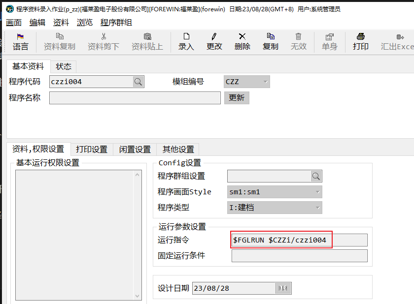
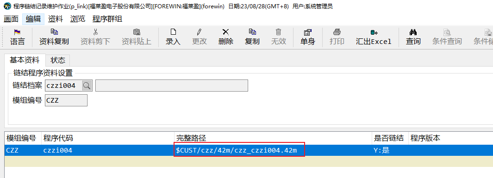
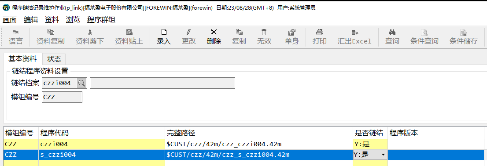

# p_link作业--使用r.l2 链接作业

无论是链接所有42m文件，还是先链接为42r文件，再链接到主程序。都需要我们将需要调用程序链接起来，如果只运行一次还好。
但是编写程序过程中难免会出错，即使能力很强，能够保证每次不出错，后续新功能增加时，也需要重新连接编译。

我们需要一种新的简单的方式去链接主程序。

## p_link

之前我们使用`r.c2`命令时，此命令自动将42m文件放到`42m`目录下，如果链接也能够自动链接对应的文件就好了。

`p_link`就是方便程序链接的作业。

你可以直接运行`exe2 p_link`打开作业，也可以再`p_zz`中`维护链结档资料`按钮中打开。

让我们用`tiptop gp`方式重新编译链接`czzi004.4gl`文件。

1. 建立p_zz资料



运行指令其实就是42r文件，`$CZZi`目录就是`czz/42r`目录。

2. 点击`维护链结档资料`


如果第一次建立，会提示生成链接档资料，选择是会打开`p_link`作业



自动新增的`p_link`资料只包含`czzi004.42m`主程序文件。

3. `r.c2 s_czzi004`并在p_link中新增



+ 必须先使用`r.c2`编译，`42m`目录中没有`czzi004.42m`的话，会报错
+ 完整路径是由模组编号和程序代码组合生成的

4. 输入完成后，会自动链接，如果有报错，先忽略报错，关掉报错窗口


5. 回到命令行`r.c2 czzi004`编译主程序

`database ds`编译前在第一行增加这个语句，否则会报错

6. 链接主程序`r.l2 czzi004`

```bash
/u1/genero/fgl.dev/bin/fgl2p -o czzi004.42r  libgre.42x WSHelper.42m lib.42x sub.42x qry.42x  czz_czzi004.42m czz_s_czzi004.42m

czzi004.42r has been generated successfully!
```

上面为成功通知。

我们看链接的过程，和我们直接`fgllink`有很多区别

1. `fgl2p` `r.l2` 没有使用`fgllink`

`fgl2p` 相比`fgllink`除了有链接的功能，如果链接文件包含`4gl`文件，还可以自动将`4gl`编译为`42m`后再链接。

2. `libgre.42x` `WSHelper.42m` `qry.42x`

这几个也是类似`lib`和`sub`函数库。

## 程序开发流程
<div>
<div class="mxgraph" style="max-width:100%;border:1px solid transparent;" data-mxgraph="{&quot;highlight&quot;:&quot;#0000ff&quot;,&quot;nav&quot;:true,&quot;resize&quot;:true,&quot;toolbar&quot;:&quot;zoom layers tags lightbox&quot;,&quot;edit&quot;:&quot;_blank&quot;,&quot;xml&quot;:&quot;&lt;mxfile&gt;&lt;diagram id=\&quot;bNSyRyVWsPX2r7_EQQZH\&quot; name=\&quot;Page-1\&quot;&gt;&lt;mxGraphModel dx=\&quot;1155\&quot; dy=\&quot;653\&quot; grid=\&quot;1\&quot; gridSize=\&quot;10\&quot; guides=\&quot;1\&quot; tooltips=\&quot;1\&quot; connect=\&quot;1\&quot; arrows=\&quot;1\&quot; fold=\&quot;1\&quot; page=\&quot;1\&quot; pageScale=\&quot;1\&quot; pageWidth=\&quot;850\&quot; pageHeight=\&quot;1100\&quot; math=\&quot;0\&quot; shadow=\&quot;0\&quot;&gt;&lt;root&gt;&lt;mxCell id=\&quot;0\&quot;/&gt;&lt;mxCell id=\&quot;1\&quot; parent=\&quot;0\&quot;/&gt;&lt;mxCell id=\&quot;10\&quot; style=\&quot;edgeStyle=none;html=1;entryX=0.5;entryY=0;entryDx=0;entryDy=0;\&quot; edge=\&quot;1\&quot; parent=\&quot;1\&quot; source=\&quot;2\&quot; target=\&quot;5\&quot;&gt;&lt;mxGeometry relative=\&quot;1\&quot; as=\&quot;geometry\&quot;/&gt;&lt;/mxCell&gt;&lt;mxCell id=\&quot;2\&quot; value=\&quot;开始\&quot; style=\&quot;rounded=1;whiteSpace=wrap;html=1;\&quot; vertex=\&quot;1\&quot; parent=\&quot;1\&quot;&gt;&lt;mxGeometry x=\&quot;270\&quot; y=\&quot;40\&quot; width=\&quot;120\&quot; height=\&quot;60\&quot; as=\&quot;geometry\&quot;/&gt;&lt;/mxCell&gt;&lt;mxCell id=\&quot;11\&quot; style=\&quot;edgeStyle=none;html=1;entryX=0.5;entryY=0;entryDx=0;entryDy=0;\&quot; edge=\&quot;1\&quot; parent=\&quot;1\&quot; source=\&quot;5\&quot; target=\&quot;6\&quot;&gt;&lt;mxGeometry relative=\&quot;1\&quot; as=\&quot;geometry\&quot;/&gt;&lt;/mxCell&gt;&lt;mxCell id=\&quot;5\&quot; value=\&quot;p_zz新增资料\&quot; style=\&quot;rounded=0;whiteSpace=wrap;html=1;\&quot; vertex=\&quot;1\&quot; parent=\&quot;1\&quot;&gt;&lt;mxGeometry x=\&quot;270\&quot; y=\&quot;160\&quot; width=\&quot;120\&quot; height=\&quot;60\&quot; as=\&quot;geometry\&quot;/&gt;&lt;/mxCell&gt;&lt;mxCell id=\&quot;12\&quot; style=\&quot;edgeStyle=none;html=1;\&quot; edge=\&quot;1\&quot; parent=\&quot;1\&quot; source=\&quot;6\&quot; target=\&quot;7\&quot;&gt;&lt;mxGeometry relative=\&quot;1\&quot; as=\&quot;geometry\&quot;/&gt;&lt;/mxCell&gt;&lt;mxCell id=\&quot;6\&quot; value=\&quot;p_link新增资料\&quot; style=\&quot;rounded=0;whiteSpace=wrap;html=1;\&quot; vertex=\&quot;1\&quot; parent=\&quot;1\&quot;&gt;&lt;mxGeometry x=\&quot;270\&quot; y=\&quot;270\&quot; width=\&quot;120\&quot; height=\&quot;60\&quot; as=\&quot;geometry\&quot;/&gt;&lt;/mxCell&gt;&lt;mxCell id=\&quot;13\&quot; style=\&quot;edgeStyle=none;html=1;entryX=0.5;entryY=0;entryDx=0;entryDy=0;\&quot; edge=\&quot;1\&quot; parent=\&quot;1\&quot; source=\&quot;7\&quot; target=\&quot;8\&quot;&gt;&lt;mxGeometry relative=\&quot;1\&quot; as=\&quot;geometry\&quot;/&gt;&lt;/mxCell&gt;&lt;mxCell id=\&quot;7\&quot; value=\&quot;主程序代码\&quot; style=\&quot;rounded=0;whiteSpace=wrap;html=1;\&quot; vertex=\&quot;1\&quot; parent=\&quot;1\&quot;&gt;&lt;mxGeometry x=\&quot;270\&quot; y=\&quot;380\&quot; width=\&quot;120\&quot; height=\&quot;60\&quot; as=\&quot;geometry\&quot;/&gt;&lt;/mxCell&gt;&lt;mxCell id=\&quot;8\&quot; value=\&quot;需要修改外部函数否\&quot; style=\&quot;rhombus;whiteSpace=wrap;html=1;\&quot; vertex=\&quot;1\&quot; parent=\&quot;1\&quot;&gt;&lt;mxGeometry x=\&quot;270\&quot; y=\&quot;481\&quot; width=\&quot;120\&quot; height=\&quot;120\&quot; as=\&quot;geometry\&quot;/&gt;&lt;/mxCell&gt;&lt;mxCell id=\&quot;61\&quot; style=\&quot;edgeStyle=none;html=1;\&quot; edge=\&quot;1\&quot; parent=\&quot;1\&quot; source=\&quot;15\&quot; target=\&quot;16\&quot;&gt;&lt;mxGeometry relative=\&quot;1\&quot; as=\&quot;geometry\&quot;/&gt;&lt;/mxCell&gt;&lt;mxCell id=\&quot;15\&quot; value=\&quot;编译链接主程序\&quot; style=\&quot;rounded=0;whiteSpace=wrap;html=1;\&quot; vertex=\&quot;1\&quot; parent=\&quot;1\&quot;&gt;&lt;mxGeometry x=\&quot;270\&quot; y=\&quot;714\&quot; width=\&quot;120\&quot; height=\&quot;60\&quot; as=\&quot;geometry\&quot;/&gt;&lt;/mxCell&gt;&lt;mxCell id=\&quot;16\&quot; value=\&quot;运行测试\&quot; style=\&quot;rhombus;whiteSpace=wrap;html=1;\&quot; vertex=\&quot;1\&quot; parent=\&quot;1\&quot;&gt;&lt;mxGeometry x=\&quot;290\&quot; y=\&quot;830\&quot; width=\&quot;80\&quot; height=\&quot;80\&quot; as=\&quot;geometry\&quot;/&gt;&lt;/mxCell&gt;&lt;mxCell id=\&quot;26\&quot; value=\&quot;\&quot; style=\&quot;endArrow=classic;html=1;exitX=0.5;exitY=1;exitDx=0;exitDy=0;entryX=0.5;entryY=0;entryDx=0;entryDy=0;\&quot; edge=\&quot;1\&quot; parent=\&quot;1\&quot; source=\&quot;8\&quot; target=\&quot;15\&quot;&gt;&lt;mxGeometry relative=\&quot;1\&quot; as=\&quot;geometry\&quot;&gt;&lt;mxPoint x=\&quot;510\&quot; y=\&quot;600\&quot; as=\&quot;sourcePoint\&quot;/&gt;&lt;mxPoint x=\&quot;330\&quot; y=\&quot;650\&quot; as=\&quot;targetPoint\&quot;/&gt;&lt;/mxGeometry&gt;&lt;/mxCell&gt;&lt;mxCell id=\&quot;27\&quot; value=\&quot;否\&quot; style=\&quot;edgeLabel;resizable=0;html=1;align=center;verticalAlign=middle;\&quot; connectable=\&quot;0\&quot; vertex=\&quot;1\&quot; parent=\&quot;26\&quot;&gt;&lt;mxGeometry relative=\&quot;1\&quot; as=\&quot;geometry\&quot;/&gt;&lt;/mxCell&gt;&lt;mxCell id=\&quot;31\&quot; value=\&quot;\&quot; style=\&quot;endArrow=classic;html=1;exitX=1;exitY=0.5;exitDx=0;exitDy=0;\&quot; edge=\&quot;1\&quot; parent=\&quot;1\&quot; source=\&quot;8\&quot; target=\&quot;34\&quot;&gt;&lt;mxGeometry relative=\&quot;1\&quot; as=\&quot;geometry\&quot;&gt;&lt;mxPoint x=\&quot;390\&quot; y=\&quot;540\&quot; as=\&quot;sourcePoint\&quot;/&gt;&lt;mxPoint x=\&quot;491\&quot; y=\&quot;541\&quot; as=\&quot;targetPoint\&quot;/&gt;&lt;Array as=\&quot;points\&quot;&gt;&lt;mxPoint x=\&quot;460\&quot; y=\&quot;541\&quot;/&gt;&lt;mxPoint x=\&quot;460\&quot; y=\&quot;300\&quot;/&gt;&lt;/Array&gt;&lt;/mxGeometry&gt;&lt;/mxCell&gt;&lt;mxCell id=\&quot;32\&quot; value=\&quot;是\&quot; style=\&quot;edgeLabel;resizable=0;html=1;align=center;verticalAlign=middle;\&quot; connectable=\&quot;0\&quot; vertex=\&quot;1\&quot; parent=\&quot;31\&quot;&gt;&lt;mxGeometry relative=\&quot;1\&quot; as=\&quot;geometry\&quot;/&gt;&lt;/mxCell&gt;&lt;mxCell id=\&quot;34\&quot; value=\&quot;增加外部函数\&quot; style=\&quot;rhombus;whiteSpace=wrap;html=1;\&quot; vertex=\&quot;1\&quot; parent=\&quot;1\&quot;&gt;&lt;mxGeometry x=\&quot;490\&quot; y=\&quot;255.5\&quot; width=\&quot;90\&quot; height=\&quot;89\&quot; as=\&quot;geometry\&quot;/&gt;&lt;/mxCell&gt;&lt;mxCell id=\&quot;36\&quot; value=\&quot;\&quot; style=\&quot;endArrow=classic;html=1;\&quot; edge=\&quot;1\&quot; parent=\&quot;1\&quot; source=\&quot;34\&quot; target=\&quot;38\&quot;&gt;&lt;mxGeometry relative=\&quot;1\&quot; as=\&quot;geometry\&quot;&gt;&lt;mxPoint x=\&quot;580\&quot; y=\&quot;540\&quot; as=\&quot;sourcePoint\&quot;/&gt;&lt;mxPoint x=\&quot;670\&quot; y=\&quot;544.8461538461538\&quot; as=\&quot;targetPoint\&quot;/&gt;&lt;/mxGeometry&gt;&lt;/mxCell&gt;&lt;mxCell id=\&quot;37\&quot; value=\&quot;是\&quot; style=\&quot;edgeLabel;resizable=0;html=1;align=center;verticalAlign=middle;\&quot; connectable=\&quot;0\&quot; vertex=\&quot;1\&quot; parent=\&quot;36\&quot;&gt;&lt;mxGeometry relative=\&quot;1\&quot; as=\&quot;geometry\&quot;/&gt;&lt;/mxCell&gt;&lt;mxCell id=\&quot;41\&quot; style=\&quot;edgeStyle=none;html=1;entryX=0.5;entryY=0;entryDx=0;entryDy=0;\&quot; edge=\&quot;1\&quot; parent=\&quot;1\&quot; source=\&quot;38\&quot; target=\&quot;39\&quot;&gt;&lt;mxGeometry relative=\&quot;1\&quot; as=\&quot;geometry\&quot;/&gt;&lt;/mxCell&gt;&lt;mxCell id=\&quot;38\&quot; value=\&quot;编写子程序\&quot; style=\&quot;rounded=0;whiteSpace=wrap;html=1;\&quot; vertex=\&quot;1\&quot; parent=\&quot;1\&quot;&gt;&lt;mxGeometry x=\&quot;650\&quot; y=\&quot;270\&quot; width=\&quot;120\&quot; height=\&quot;60\&quot; as=\&quot;geometry\&quot;/&gt;&lt;/mxCell&gt;&lt;mxCell id=\&quot;42\&quot; style=\&quot;edgeStyle=none;html=1;entryX=0.5;entryY=0;entryDx=0;entryDy=0;\&quot; edge=\&quot;1\&quot; parent=\&quot;1\&quot; source=\&quot;39\&quot; target=\&quot;40\&quot;&gt;&lt;mxGeometry relative=\&quot;1\&quot; as=\&quot;geometry\&quot;/&gt;&lt;/mxCell&gt;&lt;mxCell id=\&quot;39\&quot; value=\&quot;编译子程序\&quot; style=\&quot;rounded=0;whiteSpace=wrap;html=1;\&quot; vertex=\&quot;1\&quot; parent=\&quot;1\&quot;&gt;&lt;mxGeometry x=\&quot;650\&quot; y=\&quot;430\&quot; width=\&quot;120\&quot; height=\&quot;60\&quot; as=\&quot;geometry\&quot;/&gt;&lt;/mxCell&gt;&lt;mxCell id=\&quot;66\&quot; style=\&quot;edgeStyle=none;html=1;entryX=0.5;entryY=0;entryDx=0;entryDy=0;\&quot; edge=\&quot;1\&quot; parent=\&quot;1\&quot; source=\&quot;40\&quot; target=\&quot;15\&quot;&gt;&lt;mxGeometry relative=\&quot;1\&quot; as=\&quot;geometry\&quot;&gt;&lt;Array as=\&quot;points\&quot;&gt;&lt;mxPoint x=\&quot;710\&quot; y=\&quot;680\&quot;/&gt;&lt;mxPoint x=\&quot;330\&quot; y=\&quot;680\&quot;/&gt;&lt;/Array&gt;&lt;/mxGeometry&gt;&lt;/mxCell&gt;&lt;mxCell id=\&quot;40\&quot; value=\&quot;p_link修改资料\&quot; style=\&quot;rounded=0;whiteSpace=wrap;html=1;\&quot; vertex=\&quot;1\&quot; parent=\&quot;1\&quot;&gt;&lt;mxGeometry x=\&quot;650\&quot; y=\&quot;593\&quot; width=\&quot;120\&quot; height=\&quot;60\&quot; as=\&quot;geometry\&quot;/&gt;&lt;/mxCell&gt;&lt;mxCell id=\&quot;44\&quot; value=\&quot;修改外部函数\&quot; style=\&quot;rhombus;whiteSpace=wrap;html=1;\&quot; vertex=\&quot;1\&quot; parent=\&quot;1\&quot;&gt;&lt;mxGeometry x=\&quot;490\&quot; y=\&quot;420\&quot; width=\&quot;90\&quot; height=\&quot;80\&quot; as=\&quot;geometry\&quot;/&gt;&lt;/mxCell&gt;&lt;mxCell id=\&quot;46\&quot; value=\&quot;\&quot; style=\&quot;endArrow=classic;html=1;exitX=0.5;exitY=1;exitDx=0;exitDy=0;entryX=0.5;entryY=0;entryDx=0;entryDy=0;\&quot; edge=\&quot;1\&quot; parent=\&quot;1\&quot; source=\&quot;34\&quot; target=\&quot;44\&quot;&gt;&lt;mxGeometry relative=\&quot;1\&quot; as=\&quot;geometry\&quot;&gt;&lt;mxPoint x=\&quot;550\&quot; y=\&quot;600\&quot; as=\&quot;sourcePoint\&quot;/&gt;&lt;mxPoint x=\&quot;610\&quot; y=\&quot;630\&quot; as=\&quot;targetPoint\&quot;/&gt;&lt;/mxGeometry&gt;&lt;/mxCell&gt;&lt;mxCell id=\&quot;47\&quot; value=\&quot;否\&quot; style=\&quot;edgeLabel;resizable=0;html=1;align=center;verticalAlign=middle;\&quot; connectable=\&quot;0\&quot; vertex=\&quot;1\&quot; parent=\&quot;46\&quot;&gt;&lt;mxGeometry relative=\&quot;1\&quot; as=\&quot;geometry\&quot;/&gt;&lt;/mxCell&gt;&lt;mxCell id=\&quot;50\&quot; value=\&quot;删除外部函数\&quot; style=\&quot;rhombus;whiteSpace=wrap;html=1;\&quot; vertex=\&quot;1\&quot; parent=\&quot;1\&quot;&gt;&lt;mxGeometry x=\&quot;495\&quot; y=\&quot;583\&quot; width=\&quot;80\&quot; height=\&quot;80\&quot; as=\&quot;geometry\&quot;/&gt;&lt;/mxCell&gt;&lt;mxCell id=\&quot;51\&quot; value=\&quot;\&quot; style=\&quot;endArrow=classic;html=1;exitX=0.5;exitY=1;exitDx=0;exitDy=0;entryX=0.5;entryY=0;entryDx=0;entryDy=0;\&quot; edge=\&quot;1\&quot; parent=\&quot;1\&quot; source=\&quot;44\&quot; target=\&quot;50\&quot;&gt;&lt;mxGeometry relative=\&quot;1\&quot; as=\&quot;geometry\&quot;&gt;&lt;mxPoint x=\&quot;440\&quot; y=\&quot;720\&quot; as=\&quot;sourcePoint\&quot;/&gt;&lt;mxPoint x=\&quot;540\&quot; y=\&quot;720\&quot; as=\&quot;targetPoint\&quot;/&gt;&lt;/mxGeometry&gt;&lt;/mxCell&gt;&lt;mxCell id=\&quot;52\&quot; value=\&quot;否\&quot; style=\&quot;edgeLabel;resizable=0;html=1;align=center;verticalAlign=middle;\&quot; connectable=\&quot;0\&quot; vertex=\&quot;1\&quot; parent=\&quot;51\&quot;&gt;&lt;mxGeometry relative=\&quot;1\&quot; as=\&quot;geometry\&quot;/&gt;&lt;/mxCell&gt;&lt;mxCell id=\&quot;53\&quot; value=\&quot;\&quot; style=\&quot;endArrow=classic;html=1;exitX=1;exitY=0.5;exitDx=0;exitDy=0;\&quot; edge=\&quot;1\&quot; parent=\&quot;1\&quot; source=\&quot;44\&quot; target=\&quot;39\&quot;&gt;&lt;mxGeometry relative=\&quot;1\&quot; as=\&quot;geometry\&quot;&gt;&lt;mxPoint x=\&quot;590\&quot; y=\&quot;670\&quot; as=\&quot;sourcePoint\&quot;/&gt;&lt;mxPoint x=\&quot;690\&quot; y=\&quot;670\&quot; as=\&quot;targetPoint\&quot;/&gt;&lt;/mxGeometry&gt;&lt;/mxCell&gt;&lt;mxCell id=\&quot;54\&quot; value=\&quot;是\&quot; style=\&quot;edgeLabel;resizable=0;html=1;align=center;verticalAlign=middle;\&quot; connectable=\&quot;0\&quot; vertex=\&quot;1\&quot; parent=\&quot;53\&quot;&gt;&lt;mxGeometry relative=\&quot;1\&quot; as=\&quot;geometry\&quot;/&gt;&lt;/mxCell&gt;&lt;mxCell id=\&quot;58\&quot; value=\&quot;结束\&quot; style=\&quot;rounded=1;whiteSpace=wrap;html=1;\&quot; vertex=\&quot;1\&quot; parent=\&quot;1\&quot;&gt;&lt;mxGeometry x=\&quot;270\&quot; y=\&quot;990\&quot; width=\&quot;120\&quot; height=\&quot;60\&quot; as=\&quot;geometry\&quot;/&gt;&lt;/mxCell&gt;&lt;mxCell id=\&quot;59\&quot; value=\&quot;是\&quot; style=\&quot;endArrow=classic;html=1;entryX=0;entryY=0.5;entryDx=0;entryDy=0;exitX=1;exitY=0.5;exitDx=0;exitDy=0;\&quot; edge=\&quot;1\&quot; parent=\&quot;1\&quot; source=\&quot;50\&quot; target=\&quot;40\&quot;&gt;&lt;mxGeometry relative=\&quot;1\&quot; as=\&quot;geometry\&quot;&gt;&lt;mxPoint x=\&quot;580\&quot; y=\&quot;540\&quot; as=\&quot;sourcePoint\&quot;/&gt;&lt;mxPoint x=\&quot;680\&quot; y=\&quot;540\&quot; as=\&quot;targetPoint\&quot;/&gt;&lt;/mxGeometry&gt;&lt;/mxCell&gt;&lt;mxCell id=\&quot;60\&quot; value=\&quot;是\&quot; style=\&quot;edgeLabel;resizable=0;html=1;align=center;verticalAlign=middle;\&quot; connectable=\&quot;0\&quot; vertex=\&quot;1\&quot; parent=\&quot;59\&quot;&gt;&lt;mxGeometry relative=\&quot;1\&quot; as=\&quot;geometry\&quot;/&gt;&lt;/mxCell&gt;&lt;mxCell id=\&quot;62\&quot; value=\&quot;\&quot; style=\&quot;endArrow=classic;html=1;exitX=0.5;exitY=1;exitDx=0;exitDy=0;entryX=0.5;entryY=0;entryDx=0;entryDy=0;\&quot; edge=\&quot;1\&quot; parent=\&quot;1\&quot; source=\&quot;16\&quot; target=\&quot;58\&quot;&gt;&lt;mxGeometry relative=\&quot;1\&quot; as=\&quot;geometry\&quot;&gt;&lt;mxPoint x=\&quot;440\&quot; y=\&quot;960\&quot; as=\&quot;sourcePoint\&quot;/&gt;&lt;mxPoint x=\&quot;540\&quot; y=\&quot;960\&quot; as=\&quot;targetPoint\&quot;/&gt;&lt;/mxGeometry&gt;&lt;/mxCell&gt;&lt;mxCell id=\&quot;63\&quot; value=\&quot;成功\&quot; style=\&quot;edgeLabel;resizable=0;html=1;align=center;verticalAlign=middle;\&quot; connectable=\&quot;0\&quot; vertex=\&quot;1\&quot; parent=\&quot;62\&quot;&gt;&lt;mxGeometry relative=\&quot;1\&quot; as=\&quot;geometry\&quot;/&gt;&lt;/mxCell&gt;&lt;mxCell id=\&quot;68\&quot; value=\&quot;\&quot; style=\&quot;endArrow=classic;html=1;exitX=0;exitY=0.5;exitDx=0;exitDy=0;entryX=0;entryY=0.5;entryDx=0;entryDy=0;\&quot; edge=\&quot;1\&quot; parent=\&quot;1\&quot; source=\&quot;16\&quot; target=\&quot;7\&quot;&gt;&lt;mxGeometry relative=\&quot;1\&quot; as=\&quot;geometry\&quot;&gt;&lt;mxPoint x=\&quot;150\&quot; y=\&quot;650\&quot; as=\&quot;sourcePoint\&quot;/&gt;&lt;mxPoint x=\&quot;250\&quot; y=\&quot;650\&quot; as=\&quot;targetPoint\&quot;/&gt;&lt;Array as=\&quot;points\&quot;&gt;&lt;mxPoint x=\&quot;200\&quot; y=\&quot;870\&quot;/&gt;&lt;mxPoint x=\&quot;200\&quot; y=\&quot;410\&quot;/&gt;&lt;/Array&gt;&lt;/mxGeometry&gt;&lt;/mxCell&gt;&lt;mxCell id=\&quot;69\&quot; value=\&quot;失败\&quot; style=\&quot;edgeLabel;resizable=0;html=1;align=center;verticalAlign=middle;\&quot; connectable=\&quot;0\&quot; vertex=\&quot;1\&quot; parent=\&quot;68\&quot;&gt;&lt;mxGeometry relative=\&quot;1\&quot; as=\&quot;geometry\&quot;/&gt;&lt;/mxCell&gt;&lt;/root&gt;&lt;/mxGraphModel&gt;&lt;/diagram&gt;&lt;/mxfile&gt;&quot;}"></div>
<script type="text/javascript" src="https://viewer.diagrams.net/js/viewer-static.min.js"></script>
</div>

