# 控件&容器

打开`genero studio`，我的版本为`2.40.11`，请打开和 ERP 版本相对应的`genero studio`。

> 使用`fglform -V`可以查看版本，只要大版本一直即可，即`2.40.xx`


新建一个 4fd 文件，我这里命名为`czzi002.4fd`，你可以按照喜好自己行命名。


一个空的 4fd 文件看起来就是一张空白纸，我们只要将你需要的东西用鼠标拖拽到这张之上即可。

当然拖拽也是有规律的，否则无法生成你想要的画面，甚至还会报错。

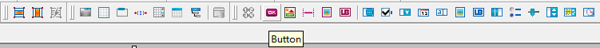

在顶部菜单中不同名称的按钮，都是一个个`控件`和`容器`。

- 控件：

GUI 中数据操作方法的合集叫做控件，它能够对数据进行操作。

- 容器：

容器是用来包裹控件，让控件已希望的方式展现出来的元素。

## 容器

容器均具有本身的属性及特殊用途，容器间可相互包覆（基本物件除外），以呈现不同的效果。

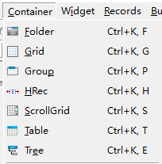

不同容器清单说明如下：

| 名称                    | 功能说明                   | 可使用的下层容器物件                                       |
| :---------------------- | :------------------------- | :--------------------------------------------------------- |
| Grid                    | 简易空白画布               | ScrollGrid、Table、GroupBox                                |
| ScrollGrid              | 有卷轴的空白画布           | ScrollGrid、Table、GroupBox                                |
| Table                   | 以表格方式显示阵列资料     | 无                                                         |
| MFArray                 | 以画布方式显示阵列资料     | 无                                                         |
| GroupBox                | 将外层加上框线             | VBOX、HBOX、GroupBox、PageControl、Grid、ScrollGrid、Table |
| PageControl             | 以分页方式显示资料         | VBOX、HBOX、GroupBox、PageControl、Grid、ScrollGrid、Table |
| VBOX(Vertical layout)   | 将内含的物件以垂直方式排列 | VBOX、HBOX、GroupBox、PageControl、Grid、ScrollGrid、Table |
| HBOX(Horizontal layout) | 将内含的物件以水平方式排列 | VBOX、HBOX、GroupBox、PageControl、Grid、ScrollGrid、Table |

### Grid


可将此容器视为一块空白的画布，布置在上方的元件都可以显示在画面相对位置上。

Grid 只能处理`非阵列资料`。Grid 不可以被安排在其他 Grid 容器之内。


**studio**

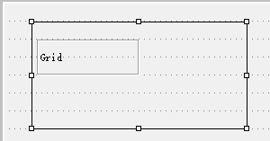

<--->

**画面预览**




### Floder


当摆放元件空间不足时（或是需要滚动画面，操作上较麻烦时），即可使用切页的功能，以资料夹的形式将资料性质相近的栏位，切分在同样的 page 当中。

制作时可在页签位置以鼠标右键新增、删除页面。

编译时若该页签内没有任何元件，则编译会失败，且系统会显示有空白页签存在。
页签上显示字符串仍需在属性视窗指定。


**studio**


<--->

**画面预览**

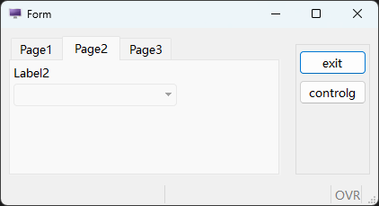



### Group

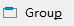

相关栏位可用 Group 包覆，以让相近性质的栏位可以明确的群聚于同处。

编写时须注意：

- 若不需要 Group 名称，则可以不要设定`textGroup`、`Text`属性。
- 若要分组但不要框线，请改用 Grid。


**studio**

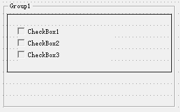

<--->

**画面预览**




### HRec


HRec 用 spacer 来保留画面一定的空格符数。当元件在容器中时，若不使用 HRec，则在预览时会发现想要保留的空格符，实际上并没有被保留。点选 HRec 里面的元件或是 spacer 时，可以在元件的左右加入 spacer（Spacer left and Spacer right）。


**studio**


<--->

**画面预览**

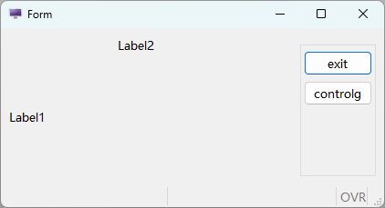



### ScrollGrid


在 Genero Studio 中，此容器与 Grid 相同，均作为处理`非阵列资料`用。与 Grid 容器的差异仅在可使用滚动轴，可以滚动画面。不能用于显示阵列资料。

**studio**

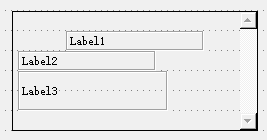

<--->

**画面预览**

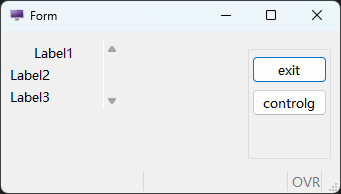



### Table


使用 TABLE 即是以表格方式显示阵列资料，此方式有许多的优点，这些优点都是系统提供的，不需要额外再撰写程序码即可使用；

包含：动态排序、栏位隐藏、显示或移动等。
在设计时期改变 Table 高度时，会自动增减资料的行数。
在 Table 物件上按鼠标右键，在弹出式选单可以新增或移除栏位。

另外可以直接以鼠标拖曳改变栏位的顺序。

编写时须注意：

- 使用 TABLE 物件时，资料（Record）一定是横列，没有直垂直排列。
- 编写时须到各栏位的属性中进行形态、对应数据库等资料的设定或变更。


**studio**


<--->

**画面预览**




### Tree

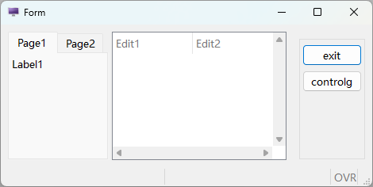

Tree 树状图预览时和 Table 是一样的，当有资料的资料，树状图是有层级结构的。

当节点展开时，可以展开上下级结构。


**studio**

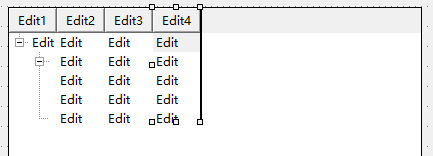

<--->

**画面预览**




## 布局

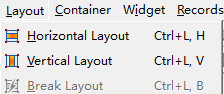

当有多个容器（Container）同时并存在同一层画面上，设计画面时就必须再对这多个容器进行位置排列的指定。


**VBox**

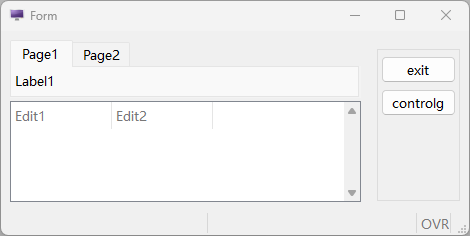

<--->

**Hbox**




在设计视窗中，以多选物件的方式，选取两个以上的物件后，工具列上的`Layout 排列工具项`（Create Layout）即会被 enable，直接选取工具列中的`垂直排列`功能`Vertical`或`水平排列`功能（Horizontal），出现红色外框时，即完成排列方式指定。

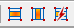

若设定完成后发现设定错误，必须取消原先设定后才能在设定新的排列方式。此时点选该红色外框，上方`取消排列`(Break Layout)即可进行取消作业。

功能说明：

 `垂直排列`功能 Vertical Layout

 `水平排列`功能 Horizontal Layout

 `取消排列`功能 Break Layout

## 控件

4FD 档在编辑时，就需要视需求将指定的元件布置在画面上。

Widget 项目如下图所示，每个项目均可以鼠标拖拉至画面上的指定位置做处理。

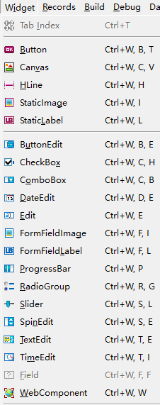

但若仅需要进行元件项目代换时，也可以透过属性页处提供的功能，直接进行转换。

以下分项目说明各种元件的差异。

### Label

定义一显示值用的栏位，可区分为下列三类。

- StaticLabel
  
  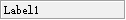

静态文字标签，可设定宽度、
前景色等。

- Text


StaticLabel 可以和 Text 相互转换。Text 字符数自动决定大小的基本静态文字标签。无法自行设定宽度。

- FormFieldLabel


动态标签元件，属于 FormField 物件，可设定与资料栏位的关联。

常用属性：

- textGroup -> text：显示说明字符串。
  
  **附注说明**

- TIPTOP GP 可支援动态画面多语言转换的功能，因此定有转换规则，符合下列规则的画面元件始能进行语系转换：
  1. 输入栏位左侧说明依同名元件方式转换
  2. TABLE 每栏栏位标题可转换
  3. 各别元件有元件 ID 足供识别可转换（含 page、groupbox、static label 等）

其余不符合上列规则者均无法于 TIPTOP GP 系统中完成多语言元件转换。

- TIPTOP GP 在设计 static label 时，要求其栏位名称必需以`dummy`为启始，以资识别为 static label。
  

### Edit

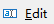
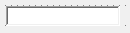

定义一个编辑栏位。属于 FormField 物件，可设定与资料栏位的关联。

常用属性：

- commentGroup -> comment：设定说明内容，当鼠标移过时会以符动视窗方式显示内容。
- constraints -> noEntry：设定此属性后即无法进入此栏位编辑资料。
- constraints -> notNull：不可在此栏位输入 NULL 值或空字符串。
- constraints -> required：不可在此栏位输入 NULL 值、空字符串或纯空格符。
- appearance -> case：令输入字符串自动转换大/小写。
- appearance -> scroll：卷动，若数据库栏宽大于画面预留栏宽时有效，当设定此属性时可藉卷动方式输入。

### Button


定义一个按钮以触发某一 4GL 中已写定的 ON ACTION 段。

建议除了特别的 ACTION 有需要在 Layout 内布置按键外，一般作业可不必布置，令其出现在 Ring Menu 处即可。

常用属性：

- commentGroup -> comment：设定说明内容，当鼠标移过时会以符动视窗方式显示内容。
- Image Group -> image：设定出现在 BUTTON 上的图片，其来源可参照 ACTION DEFAULT 段说
  明。
- textGroup -> text：显示在 BUTTON 上面的说明字符串。

### ButtonEdit


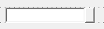

定义一个编辑栏位的元件，可透过右侧按钮以触发某一事件。通常用在串连与此栏位输入时有关的动作，例如查询合法可用资料等。此元件为 FormField 物件，可设定与数据库中资料表的栏位相关联，将 data 属性设为 TABLE_COLUMN 时可额外设定 tableName 及 columnName 这两个属性。

常用属性：

- action：设定当按下按纽时要触发 4GL 中何组 ON ACTION 段、此处定义其 action-id。
- commentGroup -> comment：设定说明内容，当鼠标移过时会以符动视窗方式显示内容。
- Image Group -> image：设定出现在 BUTTON 上的图片，其来源可参照 ACTION DEFAULT 段说明。
- constraints -> noEntry：设定此属性后即无法进入此栏位编辑资料。
- constraints -> notNull：不可在此栏位输入 NULL 值或空字符串。
- constraints -> required：不可在此栏位输入 NULL 值、空字符串或纯空格符。
- appearance -> case：令输入字符串自动转换大/小写。
- appearance -> scroll：卷动，若数据库栏宽大于画面预留栏宽时有效，当设定此属性时可藉卷动方式输入。

### ComboBox


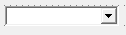

定义一个可利用下拉功能选值的编辑栏位，若输入资料只有几种值可供选择时，建议采用 RadioGroup 方式来限缩使用者可输入的内容（参阅 RadioGroup）。属于 FormField 物件，可设定与资料栏位的关联。

选项对话视窗:

可管理 ComboBox 的选项，也可以按字母顺序排列选项的 Text。

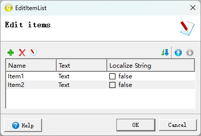

常用属性：

- commentGroup -> comment：设定说明内容，当鼠标移过时会以符动视窗方式显示内容。
- items：定义可选择的选项，用对话视窗设定。
- constraints -> noEntry：设定此属性后即无法进入此栏位编辑资料。
- constraints -> notNull：不可在此栏位输入 NULL 值或空字符串，可抑制 NULL 选项出现。
- constraints -> required：不可在此栏位输入 NULL 值、空字符串或纯空格符。
- queryEditable：当设定此属性后，若为 CONSTRUCT 模式下即可开放 USER 自行输入。
- case  令输入字符串自动转换大/小写。

### DateEdit

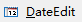


定义一个日期编辑，按右侧钮可带出 Client 端万年历选择视窗。日期显示格式由主机端 DBDATE 环境变量控制。属于 FormField 物件，可设定与资料栏位的关联。

常用属性：

- commentGroup -> comment：设定说明内容，当鼠标移过时会以符动视窗方式显示内容。
- constraints -> noEntry：设定此属性后即无法进入此栏位编辑资料。
- constraints -> required：不可在此栏位输入 NULL 值、空字符串或纯空格符。

### RadioGroup


定义一个可用选择方式输入资料的输入栏位，此种选择方式会将选项清单展示在画面上（ComboBox 不会展开显示，可参照 ComboBox 说明），故若需要采用此输入形态，要注意画面空间是否足够。


常用属性：

- commentGroup -> comment：设定说明内容，当鼠标移过时会以符动视窗方式显示内容。
- items：定义可选择的选项，依范例方式设定。【必要属性】
- constraints -> noEntry：设定此属性后即无法进入此栏位编辑资料。
- constraints -> notNull：不可在此栏位输入 NULL 值或空字符串。
- constraints -> required：不可在此栏位输入 NULL 值、空字符串或纯空格符。
- orientation：可定义选项排列方式为垂直排列（vertical）或水平排列（horizontal）。


**注意**

使用 ComboBox 可动态定义 items，而 RadioGroup 不可动态定义 items。



### CheckBox


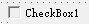

当栏位选项只有两种选择时（如：是或否，0 或 1，100 或 200 等），就可以采用此种输入型态执行输入。属于 FormField 物件，可以设定与资料栏位相关联。

常用属性：

- commentGroup -> comment：设定说明内容，当鼠标移过时会以符动视窗方式显示内容。
- constraints -> noEntry：设定此属性后即无法进入此栏位编辑资料。
- constraints -> notNull：不可在此栏位输入 NULL 值或空字符串，可抑制 NULL 选项出现。
- constraints -> required：不可在此栏位输入 NULL 值、空字符串或纯空格符。
- textGroup -> text：显示在选取格后面的说明字符串。
- valueChecked：选取核取后传入 4GL 的值，可为数字、字符、字符串。【必要属性】
- valueUnchecked：选取取消后传入 4GL 的值，可为数字、字符、字符串。【必要属性】

### HLine


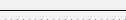

水平分隔线

### Canvas


定义一个绘图的区块以供 4GL 程序绘制图形用。

常用属性：

- commentGroup -> comment：设定说明内容，当鼠标移过时会以符动视窗方式显示内容。


**说明**

Genero BDL 可支援简易的绘图模式，但需藉由建立物件 om.DomNode 的方式来建立，此部份可参阅 Genero BDL 在线说明文件。



### ProgressBar

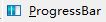


定义一水平方向的进度显示表。

常用属性：

- valueMin：定义控制数值的最小值。
- valueMax：定义控制数值的最大值。


**注意**

TIPTOP GP 中有已定义完整的 Progress Bar 处理函式，可直接呼叫使用，使用者不需自行定义 Progress Bar。



### TextEdit

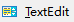
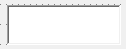

定义可编辑多行的栏位，输入长度当超过画面预留长度时，会自动出现卷轴。属于 FormField 物件，可设定与资料栏位的关联。

常用属性：

- commentGroup -> comment：设定说明内容，当鼠标移过时会以符动视窗方式显示内容。
- constraints -> noEntry：设定此属性后即无法进入此栏位编辑资料。
- constraints -> notNull：不可在此栏位输入 NULL 值或空字符串。
- constraints -> required：不可在此栏位输入 NULL 值、空字符串或纯空格符。
- appearance -> case：令输入字符串自动转换大/小写。
- scrollBars：可设定卷轴出现的位置，有 NONE、VERTICAL、HORIZONTAL、BOTH 等。
- wantTabs：当设定此属性时，允许在输入框中输入 TAB 键。
- WantNoReturns：当设定此属性时，不允许在输入框中输入 ENTER 键。

### TimeEdit

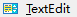


定义一个时间编辑栏位。属于 FormField 物件，可设定与资料栏位的关联。

常用属性：

- commentGroup -> comment：设定说明内容，当鼠标移过时会以符动视窗方式显示内容。
- constraints -> noEntry：设定此属性后即无法进入此栏位编辑资料。
- constraints -> required：不可在此栏位输入 NULL 值、空字符串或纯空格符。

### Image

定义一个可显示图档的区域。

Image 分为下列两种 Widget：

- StaticImage
  
  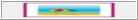

显示静态图档。

- FormFieldImage
  
  

显示动态图档

常用属性：

- autoScale：自动依画面上现行留存框格为准，调整（等比例缩放）显示在画面上的图片大小。
- geometry  Width 或 Height：不以画框的方式指定大小，而直接以画素指定的方式定宽或高。
- stretch：定义是否要出现卷轴，有 none、x、y、both 四种可选择。
  
  **说明**

- IMAGE 有区分动态或静态模式，以上范例为动态模式，影像图片在 CLEAR FORM 时会一并清除，如同一般栏位设定。若图片属于 logo 类与资料无关、不会常常切换的话，建议可改用静态图片的作法。

- 静态的以『Image Group -> image』属性以指定图片档来源。静态图片不会因 CLEAR FORM 被清除。



### Slider

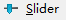


定义一个水平或垂直刻度的拖动条栏位。属于 FormField 物件，可设定与资料栏位的关联。显示的位置必须在有效范围内（在下限与上限之中）。

常用属性：

- valueMin：定义控制数值的最小值。
- valueMax：定义控制数值的最大值。
- step：刻度的间距。

### SpinEdit


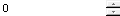

定义一个旋转编辑栏位。属于 FormField 物件，可设定与资料栏位的关联。上下图示的按钮可以增加/减少数值，也可以直接在栏位中输入数值。

常用属性：

- step：增加/减少数值的间距。

### WebComponent


WebComponent是一个可代码控制的可重用控件，并无示例，这里不展开讲。


## 其它项目

### TopMenus

TM 页签对应到fgl 中PER 档的TOMMENU Section。主要功能在将Action 依功能别群聚为一组一组，设定显示在画面上方Menu Bar，让使用者利用Pull-Down Menu 点选即可执行Action。



**注意**

在TIPTOP GP 系统中亦有使用TM 功能，但已依TIPTOP GP 特性进行设定，并
未将资料定义于4FD 档内，而是将资料另外储存于`$TOPCONFIG/4tm`下。

你在运行作业时，也能看到当前作业使用到的TopMenu文件

```bash
<topprod:/u1/topprod/tiptop/azz/4gl> exe p_zz
Execute program:p_zz
[Guard-1234]Check successfully.
<topprod:/u1/topprod/tiptop/azz/4gl>
SESSIONID:             288299771  PLANT:FOREWIN  DBNAME:forewin
INFO: Your Plant (FOREWIN) is setting in GMT+8 time zone.
No idle control
INFO: 4st for Interface Level = /u1/topprod/tiptop/config/4st/tiptop.4st
INFO: 4ad for Interface Level = /u1/topprod/tiptop/config/4ad/2/tiptop.4ad
INFO: 4ad for Form Level = /u1/topprod/tiptop/config/4ad/2/azz/p_zz.4ad
INFO: 4tm for Interface Level = /u1/topprod/tiptop/config/4tm/topmenu_i.4tm
INFO: 4tb for Interface Level = /u1/topprod/tiptop/config/4tb/toolbar_i.4tb
g_ui_setting : std
INFO: Locale feature use   0.05225 seconds.
```



### Toolbars

对应至原PER 格式的TOOLBAR Section，主要功能在定义将常用的Action 显示在画面上方TOOLBAR 处。


### Action Defaults

AD 页签对应到原PER 档的ACTION DEFAULTS 区段，主要功能是定义功能按键（Action）的属性，包含显示在画面档上的文字、快速键（1.31 以上版本允许设定至多三组）、显示图片、弹出式说明（Hint、Comments）等属性，须搭配4GL 程序才会有作用。

#### `.4ad`档

在某些特殊原因下，可照规则编写一XML 格式档案（例如下面范例：act.4ad）。

而在4GL 程序中以呼叫（CALL）ui.Interface.loadActionDefaults("4ad-filename") ，传入参数是4ad 档档名，附档名可不写；产生的结果也与在PER 档编辑ACTION DEFAULTS 段或在4FD 编写TM 功效一致。

*范例：act.4ad*

```xml
<ActionDefaultList>
    <ActionDefault name="add" text="Append" acceleratorName="CONTROL-V" />
    <ActionDefault name="del" text="Delete" acceleratorName="SHIFT-F2"/>
    <ActionDefault name="zoom" text="Zoom" comment="Open zoom window" />
    <ActionDefault name="quit" text="Quit" acceleratorName="SHIFT-F5" image="quit" />
</ActionDefaultList>
```

*4GL 引入范例：act.4gl*

```sql
MAIN
    DEFINE ls_flow_pic STRING
    CALL ui.Interface.loadActionDefaults("act")
    OPEN WINDOW act_w WITH FORM "/u1/topprod/tiptop/demo/edit"
    MENU ""
        ON ACTION add
            CALL act_a()
        ON ACTION del
            ：
        ON ACTION zoom
            ：
        ON ACTION quit
        EXIT Program
    END MENU
    ：
```

编译之后可以得到的画面与前一页相同。


**注意**

如TIPTOP GP 系统即未采用在PER 档编写ACTION DEFAULT 段的方法，原因是若编写在PER 档中，则于遭遇不同语系时，就需准备多组不同的PER 档案，如此则会增加程序开发的困难。故采用4ad 分离的方式以降低开发系统中会发生的错误情形。



### Screen Record

在4fd文件新增的可输入控件，在Records中都会生成对应屏幕变量组。


一个屏幕变量集合（Screen Record）可以包含来自不同资料表格的资料行，甚至是formonly 的栏位，若该屏幕记录恰完全属于同一个表格（table），则可以使用`table_id.*`来定义。

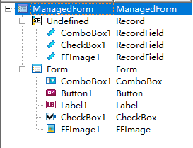

每个Table 元件都会自动建立Default Screen Record，所有的变更都会自动反应到Default Screen Record。

可以对Table 建立不同栏位顺序的额外的ScreenRecord。


**注意**

+ 使用Table 时虽然会自行建立SR 变量，但是却会以tbXX﹝即table 的名称﹞直接命名，和TIPTOP GP 对荧幕变量组命名规则不合，需要自行手动至属性页签处进行变更。
+ 栏位不可被重复定义，重复定义在编译时会产生编译错误。


### Style


在一个4fd的Form属性中有一个可以styleFile，它可以引入一个`4st`文件，这个文件可以影响4fd文件最后的样式。


studio可以新建4st文件，`tiptop gp`有默认的`4st`文件，一般不去修改。


## Tab Index

定义画面上元件的输入顺序（按Tab 键可以跳到下一个元件）。可以在Edit Menu 中的Tab Index 或是如下图中的小图示上按鼠标左键执行。

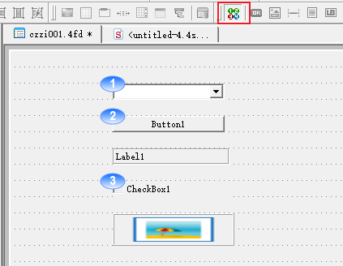

更改顺序方式：

+ 双击鼠标左键将顺序数字重设为1。
+ 在任一数字上按鼠标左键将从目前的数字顺序往下排。
+ 结束目前的设定按ESC 键。
+ 再按一次ESC 键离开Tab index 设定（数字会消失）。
更改顺序也可以透过直接更改元件的tabindex 属性的数值，但必须在离开Tab Index设定顺序的状态下。


## Alignment


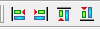

在图示列或是在选单中Alignment 的功能。

只有在同一个容器（container）内的元件（widgets）可以进行对齐功能。也可以同时选取多个元件修改它们的PosX/PosY 属性以达到对齐的功能。这些属性对上层容器物件来说是相对位置，而不是绝对位置。


# 练习

## 将每个不同的控件都拖住到4fd文件中试一试
