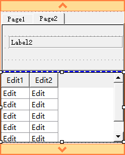
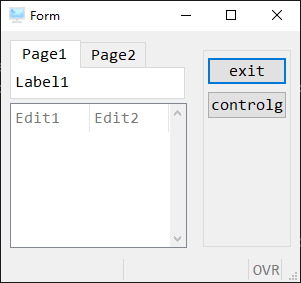

# 画面档文件的编译

`4fd`文件是我们的使用studio开发后保存的文件，但我们无法直接调用这个文件。

在BDL中我们最终能使用的画面档文件是`42f`，从`4fd`到`42f`还需要经历一个编译的过程。

`4fd` 对应代码的文件的`4gl`

`42f`对应代码文件的`42m`

## per文件

在上个世纪，和这个世纪初，编写画面档并不是鼠标拖拽这么简单，画面档也需要编写代码实现。

`per`就是BDL之前的画面档文件，和`4fd`不同，`per`文件是纯代码编写。



以上`4fd`文件，转为`per`描述如下：

```bash
SCHEMA formonly

LAYOUT (text=%"Form")
VBox VBox1
Folder Folder1
Page Page1(text=%"Page1")
Grid Grid2
{

 [label1                        ]

}
END -- Grid2
END -- Page1
Page Page2(text=%"Page2")
Grid Grid1
{

 [label2                          ]


}
END -- Grid1-
END -- Page2
END -- Folder1
Table Table1
{
[edit1   |edit2   ]
[edit1   |edit2   ]
[edit1   |edit2   ]
[edit1   |edit2   ]
[edit1   |edit2   ]
}
END -- Table1
END -- VBox1
END -- Form

ATTRIBUTES
Label label1:Label1, text=%"Label1";
Label label2:Label2, text=%"Label2";
Edit edit1=formonly.Edit1, tabIndex=1, title=%"Edit1";
Edit edit2=formonly.Edit2, tabIndex=2, title=%"Edit2";
END -- ATTRIBUTES

INSTRUCTIONS
SCREEN RECORD Record1(formonly.Edit1,formonly.Edit2)
END -- INSTRUCTIONS
```

可以看到`per`文件时相当复杂的，甚至会用空格的个数来控制栏位的大小。

虽然限制`per`文件已经被`4fd`文件替代了，但是`per`依然可以使用，实际上这两种格式文件可以任意转化。

但是并不是等价的，`per`文件的信息比`4fd`少。


## 编译为42f


`per`，`4fd`文件都是可以编译为`42f`文件的

```bash
# per
fglform czzi001
# 4fd
gsform czzi001
```

虽然命令不同，但都能生成42f文件


## 4fd 与 per 转换

### 4fd --> per

`4fd` 无法直接转为 `per`，但是`per`是编译为`42f`的中间产物，一般编译时都删除`per`文件，我们可以不删除，保留它。

```bash
gsform -keep czzi001
```

### per --> 4fd

```bash
gsform -import czzi001
```


## tiptop gp 的画面档编译方式

同`r.c2`，`r.l2 `一样，tiptop gp也封装了一些更方便的画面档编译命令。

+ r.f2 

一键编译画面档文件(不区分per和`4fd`)，在`per`文件或者`4fd`文件的目录下运行即可，可以编译为`42f`，并将文件放在对应的目录下。

```bash
r.f2 czzi001
```

+ r.gf 

任意目录下都可以运行，可以预览编译好的画面档文件。


```bash
r.gf czzi001 2 p
```



+ `2`参数 为语言别 ，2 为简体中文 1 为英文 0 为繁体中文
+ `p`参数 为客制否  p 为标准模组 c 为客制模组

