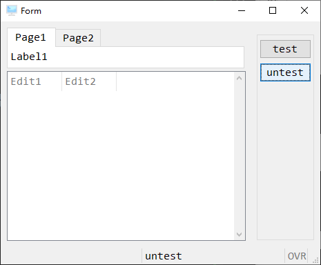

# Window & Form

在上一章节介绍如何编辑画面，但 WINDOWS 与 FORM 本身是无法执行的，它必须透过 Program 去启动它，以下介绍在程序中启动及显示 WINDOWS & FORM 的指令。

本节用到画面档时[czzi001.4fd](./czzi001.4fd)，你也可以自己创建一个喜欢的样式。

## WINDOW

### OPEN & CLOSE

```sql
database ds  -- 之后的代码默认都通过r.c2 编译，都必须指定数据库
main
    open window czz_w with form "czz/42f/czzi001"
    sleep 10
    close window czz_w
end main
```

如果你直接运行发现，并没有打开作业，请通过 debug 调试模式重新运行一下查看。


**注意**

BDL 中如果没有指定使用操作画面语句块，那么直接打开画面是看不见的。


运行一下代码：

```sql
database ds  -- 之后的代码默认都通过r.c2 编译，都必须指定数据库
main
    open window czz_w with form "czz/42f/czzi001"
    call cl_ui_init()  -- 这lib函数为初始化画面，如果不调用会出现一个空窗口。
    menu ""
        on action test
            message "test"
        on action untest
            message "untest"
        on action close
            exit menu
    end menu
    close window czz_w
end main
```

`MENU` 就是一个画面操作语句块，后面会讲到，它的功能就是生成一些按钮，tiptop gp 将这些按钮放置到了右侧。



运行结果应该如上图，`close`未生成按钮的原因是，window 系统中右上角的关闭就对应了 BDL 中的`on action close`。你可以在 debug 调试模式中验证这一点，如果点击右上角的关闭，`exit menu`程序会立即运行到这一行。

`OPEN` 除了直接打开一个 42f 文件外，还有其它可选的语法。

```sql
OPEN WINDOW window-id [AT line, column ]
    WITH [ FORM form-file | height ROWS, width COLUMNS ]
         [ ATTRIBUTES ( window-attributes ) ]
```

- `window-id`：定义这个 window name 名称。
- `AT line, column`：表示让画面开启的起始坐标，仅限于 Console 上执行有效。
- `form-file`：经过编译后的画面档文件名称(不含附档名)，之前可以指定放置路径。
- `height ROWS, width COLUMNS`：实际画面档不存在时，可先指定画面占用行数及栏数，其他部份待 4GL 执行时再行动态设定。
- `ATTRIBUTES` ( window-attributes )：可以加上属性设定。

**ATTRIBUTE 属性**

| Attribute      | 系统 Default | 说明                       |
| :------------- | :----------- | :------------------------- |
| TEXT = string  | NULL         | 将 string 显示在视窗标题列 |
| STYLE = string | NULL         | 读取 string 的画面设定属性 |

### CLEAR

在目前所显示的画面上，清除指栏位变量内容。

有两种使用方式：

1. CLEAR *field-list*

清除指定控件名的变量内容

2. CLEAR FORM *window-id*

清除整个FORM 的所有控件变量内容


### CURRENT WINDOWS 

如果一个BDL中打开了多个窗口，只有当前窗口时可以操作的，如果不想关闭当前窗口，又想操作其他窗口，可以使用`CURRENT WINDOWS`命令。
 
`CURRENT WINDOW IS *window-id*`

示例：

```sql
main
    open window w1 with form "edit"
    open window w2 with form "topmenu"
    menu "change windows"
        on action edit
            current window is w1
        call act1_a()
        on action topmenu
            current window is w2
        on action exit
            exit menu
    end menu
    close window w1
    close window w2
end main
```

上述代码只作为示例，缺少文件，无法运行。

## FORM

FORM 在Genero BDL 中的定义是简单的WINDOW，它被定义为`不需长时间出现在画面上，用在与使用者交谈些简单的问题上`，它与WINDOW 功能相比，少了切换视窗的功能等。

TIPTOP GP 多使用WINDOW。

FORM 只有三个语法，且不存在可选的其它语法

1. OPEN FORM form-id FROM “file-name”

2. DISPLAY FORM form-id

3. CLOSE FORM form-id


上面czzi001画面档，改写未open form 如下：

```sql
database ds  -- 之后的代码默认都通过r.c2 编译，都必须指定数据库
main
    open form czz_w from "czz/42f/czzi001"
    display form czz_w
    menu ""
        on action test
            message "test"
        on action untest
            message "untest"
        on action close
            exit menu
    end menu
    close form czz_w
end main
```
