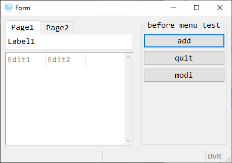
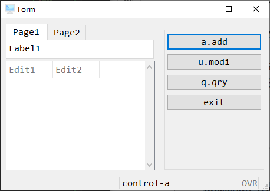
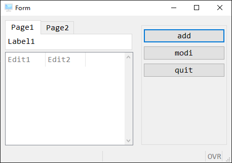
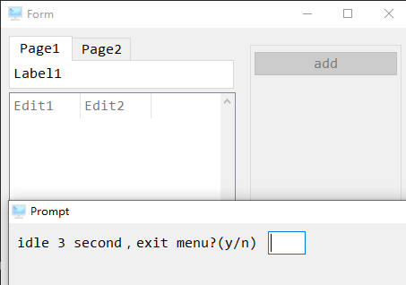
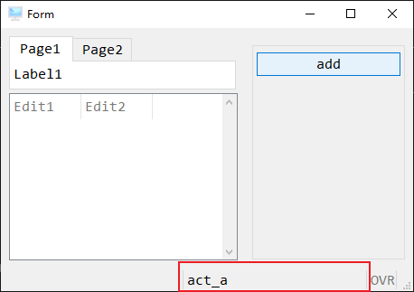

# MENU

Genero BDL 所提供的 MENU 命令，是一种环状显示的功能表（Ring Menu）。以下介绍如何操作并设定想要的功能。

## MENU 命令

`MENU`语法类似下面这样:

```bash
MENU [title] ATTRIBUTE ( control-attributes )

    BEFORE MENU

    COMMAND option [comment]
        [ HELP help-number ]

    COMMAND KEY ( key-name )
        option [comment]
        [ HELP help-number ]

    ON ACTION action-name

    ON IDLE idle-seconds

END MENU
```

**说明：**

1. 在一个 MENU 中，可以定义 menu 的属性，STYLE 属性预设'default'。

属性包括:

| 属性             | 描述                                                    |
| :--------------- | :------------------------------------------------------ |
| STYLE = string   | 定义 menu 型态，值可以为'default'， 'dialog' or 'popup' |
| COMMENT = string | 定义 menu show 出来的讯息                               |
| IMAGE = string   | 定义选单中的图示                                        |


2. BEFORE MENU 可以不写，若有一些特别的控管如隐藏某些menu 功能或参数控管是否进入某menu 功能时， 可在BEFORE MENU 来下一些menu-statemenu 来控管menu 部份。

3. 功能表仅为让使用者选择要执行的功能用，其他功能则不在此指令支援的范围中，例如：支援完整的TABLE 或SCROLLGRID 显示（使用时，若存在超过荧幕可一次显示的资料量，则只能显示前几笔，卷轴是无效的）等。

示例：

```bash
main
    define ls_flow_pic string
    open window act_w with form "czz/42f/czzi001"
        attribute(style = "tiptop.4st" )
    menu "before menu test"

        before menu
            hide option "del" #隐藏del 功能
            #show option "del" #显示del 功能
                #：
        on action add

        on action del
        
        on action quit
            exit menu

        on action modi

    end menu
    close form a1
    close window act_w
end main
```



## MENU-OPTION

在MENU中你可以定义多种的MENU-OPTION，每个MENU-OPTION 代表一个功能。

当触发到这个option，就会运行option后的功能。

1. COMMAND option：定义MENU 功能名称及定义进入某功能快速键，透过COMMAND 指令清楚掌握USER ACTION。

2. COMMAND key：定义MENU 功能快速键，且不须show 在menu 上

```bash
database ds
main
    open window act_w with form "czz/42f/czzi001"

    menu ""
        command "a.add" #menu 功能名称"a.新增"，a 为快速键
            message "a.add"

        command "u.modi"
            message "u.modi"
            
        command "q.qry"
            message "q.qry"

        command key (control-a) # control-a 为快速键且
            message "control-a" #此功能不show menu 上

        command "exit"
            close window act_w
            exit program
    end menu
end main
```



3. ON ACTION：跟COMMAND 指令功能一样，不同是COMMAND 可以重复定义COMMAND KEY，执行时以最后定义为主，但是ON ACTION 不能重复定义，compiler 会产生错误，两者定义名称时都不分大小写


```bash
database ds
main
    open window act_w with form "czz/42f/czzi001"
    menu ""
        on action add
            message "act_a"
        on action modi
            message "modi"
        on action quit
            exit program
    end menu
    close window act_w
end main
```




4. ON IDLE：在menu 中主要来控管停留在menu 段的时间是否闲置太久，透过ON IDLE 指令时间一到，可执行系统指定的IDLE 处理程序（如执行强制中断程序或 显示违规警示等），以减少可执行权（license）被占用或系统资料被锁定等相关问题。

```bash
database ds
main
    define l_chr varchar(4)
    open window act_w with form "czz/42f/czzi001"
    menu ""
        on action add
            call act_a()
        on idle 3 #闲置时间超过3 秒处理流程
            prompt "idle 3 second，exit menu?(y/n) " for l_chr
            if l_chr='y' or l_chr='y' then
                close window act_w
                exit program
            else
                continue menu
            end if
    end menu
end main
```




## MESSAGE

在这一节中，你应该能看到很多地方调用了`message`语句，它的功能就是将后面的字符串显示在屏幕上，并且不会影响程序的执行。



`message`不像`on action `这类语法要以来`menu`块语句中。
它并不依赖于上下文，但使用也有一个前提，必须打开一个画面文件。
它像是一个`display`命令的GUI版本。

### attribute

message除了默认样式还支持一些字体颜色的设置。
如下：

    { BLACK | BLUE | CYAN | GREEN
    | MAGENTA | RED | WHITE | YELLOW
    | BOLD | DIM | INVISIBLE | NORMAL
    | REVERSE | BLINK | UNDERLINE
    | STYLE = "style-name"
    }

具体用法如下：

```bash
message "i'm red blod" ATTRIBUTE (RED BOLD)
```