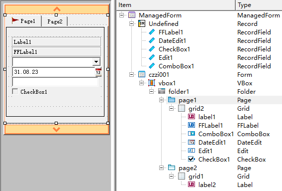
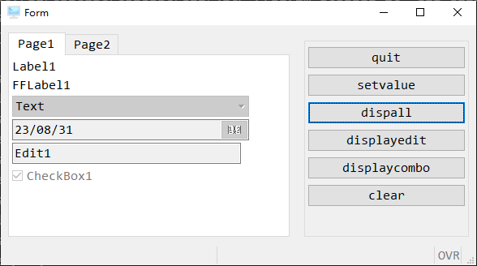
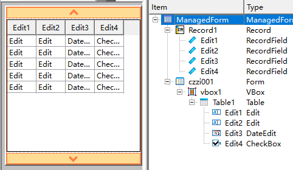
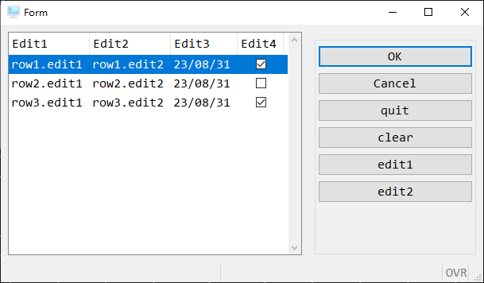

# DISPLAY

在之前终端执行程序时，我们一直使用`DISPLAY`讲字符串显示到终端。
在程序升级到GUI版本后，我们不需要再回去看终端了，`DISPLAY`有了新的用法。


**注意**

因为BDL中，表格和非表格的控件方式有明显区别，所以讲非表格控件称为`表单`,表格称为`表格`。这并不是通用的定义，仅为了在本教程中方便区分两种。

- 表格
- 表单 


## DISPLAY 表单



[4fd文件](./attach/czzi001.4fd)

```bash
database ds
main
    define sr record
        FFLabel1 varchar(40),
        ComboBox1 varchar(40),
        DateEdit1 date,
        Edit1 varchar(40),
        CheckBox1 varchar(40)
    end record
    open window act_w with form "czz/42f/czzi001"

    menu ''
        on action quit
            exit menu
        on action setvalue
            let sr.FFLabel1 = 'FFLabel1 '
            let sr.ComboBox1 = 'Item2'
            let sr.DateEdit1 = today
            let sr.Edit1 = 'Edit1'
            let sr.CheckBox1 = '1'
        on action dispall
            display by name sr.*
            
        on action displayedit
            display sr.DateEdit1 to DateEdit1
            display "OK" to Edit1 ATTRIBUTE (BOLD)
        
        on action displaycombo
            display by name sr.ComboBox1

        on action clear
            clear form
    end menu
    close window act_w
end main
```

运行尝试一下每个按钮功能



在上述代码中，我们可以看到`display`显示到`GUI`表单中有两种用法。

1. `display to`

    display 值1,值2,...  to 控件名1,控件名2,...

能将任何值直接显示到指定的控件上

2. `display by name`

    display by name 值1,值2,...
    display by name 结构体变量.*

这种方式并没有指定控件名，所以你的变量名必须和控件名一样，否则不会显示。

如果你的变量是结构体，那么`成员名`必须和控件名一样。且如果结构体所有变量都要显示到控件上，那么可以简写为`结构体变量.*`。


## DISPLAY 表格




[4fd文件](attach/czzi000.4fd)

```sql
database ds
main
    define list dynamic array of record
        Edit1 varchar(40),
        Edit2 varchar(40),
        Edit3 date,
        Edit4 varchar(40)
    end record
    open window act_w with form "czz/42f/czzi001"

    let list[1].Edit1 = 'row1.edit1'
    let list[1].Edit2 = 'row1.edit2'
    let list[1].Edit3 = today
    let list[1].Edit4 = '1'

    let list[2].Edit1 = 'row2.edit1'
    let list[2].Edit2 = 'row2.edit2'
    let list[2].Edit3 = today
    let list[2].Edit4 = '0'

    let list[3].Edit1 = 'row3.edit1'
    let list[3].Edit2 = 'row3.edit2'
    let list[3].Edit3 = today
    let list[3].Edit4 = '1'

    display array list to Record1.*
    
        before display

        on action quit
            exit display
        
        on action clear
            clear form
        
        on action edit1
            let list[1].Edit1 = 'edit1'

        on action edit2
            let list[1].Edit1 = 'edit2'
        
    end display
    
    close window act_w
end main
```



`display array`是一个语法块，除了将一个数字显示到表格上，还可以生成按钮功能。

`display array`中的变量必须是一个结构体数组，且结构体数组成员的变量的`名称`、`顺序`必须要和4fd中的`screen record一致`。当然变量的类型也需要一样，但是有些类型可以自动转换。

### 触发语句

`display array` 还支持大部分的`MENU`功能，上面代码中就使用了 `on action `功能。在有表格的场景，`display array`一般代替`menu`。

+ BEFORE DISPLAY 运行一次
+ AFTER DISPLAY 运行一次
+ BEFORE ROW 到新的一行时触发
+ AFTER ROW 离开当前行触发
+ ON IDLE idle-seconds 超时触发
+ ON ACTION action-name 按钮触发
+ ON FILL BUFFER 缓存化学
+ ON APPEND 插入时触发
+ ON INSERT 新增时触发
+ ON UPDATE 更新时触发
+ ON DELETE 删除时触发
+ ON EXPAND 树状图展开触发
+ ON COLLAPSE 树状图关闭触发
+ ON DRAG_START ( dnd-object ) 拖拽时才可用
+ ON DRAG_FINISH ( dnd-object ) 拖拽时才可用
+ ON DRAG_ENTER ( dnd-object ) 拖拽时才可用
+ ON DRAG_OVER ( dnd-object ) 拖拽时才可用
+ ON DROP ( dnd-object ) 拖拽时才可用
+ ON KEY ( key-name [,...] )


看起来可用的语法有很多个，单实际上，很简单，你需要的时候拿来用即可。
可以把`DISPLAY ARRAY`看为一个转盘路，这些触发性的语法，是在转盘路之中的红灯，你遇到红灯需要花费时间将这些触发语法下面的语句运行完成，再继续上路。

### 退出display

`DISPLAY ARRAY`就是进入转盘路的开始，而`exit display`和`accept display`就是退出转盘路的出口。
在上面程序中除了自己定义的按钮还额外多了一个`OK`和一个`Cancel`按钮，这两个按钮分别对应就是这两种退出方式。

+ OK 确认 自动运行 accept display  内置的变量int_flag赋值为0
+ Cancel 取消 自动运行 exit display  内置的变量int_flag赋值为1


**注意**

OK、Cancel还分别对应了`ON ACTION accept`和`ON ACTION Cancel`。如果你要写上着两个`action`,`exit display`和`accept display`就不会自动运行了，你可以自己写上或者运行其它逻辑也可以。




### ATTRIBUTES

和基础`DISPLAY`、`DISPLAY TO` 语法一样，`DISPLAY ARRAY`一样支持`ATTRIBUTES`属性。

```sql
DISPLAY ARRAY g_ima to s_ima.* ATTRIBUTES(BLOD)
    ...
END DISPLAY
```

除了字体样式，在`DISPLAY ARRAY`中还支持更多配置参数

```sql
{ ACCEPT [ = boolean ]  -- 确认按钮
| CANCEL [ = boolean ]  -- 取消按钮
| KEEP CURRENT ROW [ = boolean ] -- 焦点不在表格时，还突出显示当前行
| HELP = help-number 
| COUNT = row-count -- 使用定长数组时，需要指定显示行数
| UNBUFFERED [ = boolean ] -- 修改变量自动显示到画面，而无需再次DISPLAY
}
```

